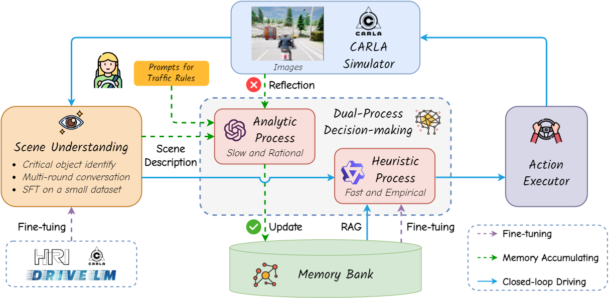
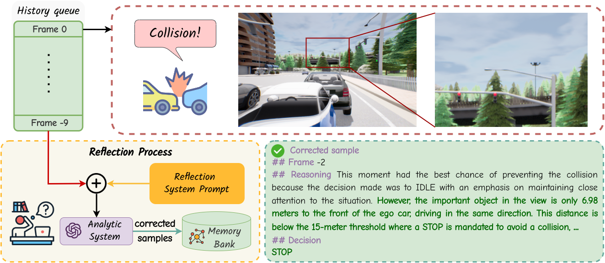

#  Continuously Learning, Adapting, and Improving: A Dual-Process Approach to Autonomous Driving

  

<!-- **LeapAD**, a new autonomous driving paradigm inspired by human cognition, improves adaptability and interpretability in complex scenarios through dual-process decision-making and continuous learning from past experiences. -->

> Jianbiao Mei1,2,\*, Yukai Ma1,2,\*, Xuemeng Yang2, Licheng Wen2, Xinyu Cai2, Xin Li2,3, Daocheng Fu2, Bo Zhang2, Pinlong Cai2, Min Dou2, Botian Shi2,†, Liang He3, Yong Liu1,†, Yu Qiao2  
> 1 Zhejiang University 2 Shanghai Artificial Intelligence Laboratory 3 East China Normal University 
> \* Equal Contribution † Corresponding Authors

## 📖 News

- `[2024-5-27]` The paper can be accessed at [arxiv](https://arxiv.org/abs/2405.15324)

- `[2024-5-22]` We released our project website [here](https://leapad-2024.github.io/LeapAD/)

---

## 🎯 Overview
We introduce **LeapAD**, a novel paradigm for autonomous driving inspired by the human cognitive process. Specifically, LeapAD emulates human attention by selecting critical objects relevant to driving decisions, simplifying environmental interpretation, and mitigating decision-making complexities. Additionally, LeapAD incorporates an innovative dual-process decision-making module, which consists of an **Analytic Process** (System-II) for thorough analysis and reasoning, along with a **Heuristic Process** (System-I) for swift and empirical processing. 

  

The scene understanding module analyzes surrounding images and provides descriptions of critical objects that may influence driving decisions. These scenario descriptions are then fed into the dual-process decision module for reasoning and decision-making. The generated decisions are then transmitted to action executor, where they are converted into control signals for interaction with the simulator. 
The Analytic Process then uses an LLM to accumulate driving analysis and decision-making experience and conduct reflection on accidents. The experience is stored in the memory bank and transferred to a lightweight language model, forming our Heuristic Process for quick responses and continuous learning.

    

When Heuristic Process encounters traffic accidents, the Analytic Process intervenes, analyzing historical frames to pinpoint errors and provide corrected samples. These corrected samples are then integrated into the memory bank to facilitate continuous learning.

<!-- The **Analytic Process** is designed for thorough analysis and reasoning. It handles complex scenarios and builds a comprehensive memory bank for high-quality driving decisions. The Analytic Process accumulates experience and updates the memory bank through analysis of accidents and self-reflection. This accumulated knowledge can be transferred into the Heuristic Process by supervised fine-tuning (SFT), ensuring the entire LeapAD system can continuously improve and adapt to new driving environments and challenges.

The **Heuristic Process** uses several strategies to perform closed-loop decisions.  It is designed to enable instant decision-making within the vehicle. The Heuristic Process relies on knowledge transferred from the analytical process to make fast and efficient decisions during driving. This lightweight model ensures fast response and adaptability in various driving scenarios, maintaining a high level of performance with minimal computing resources. -->

## 🛣️ Demo Video in CARLA

<video width="800" controls>
  <source src="videos/case2.mp4" type="video/mp4">
</video>

https://github.com/PJLab-ADG/LeapAD/assets/18390668/f5383343-a5cd-4fd3-aaf7-98302d9ea6cf

https://github.com/PJLab-ADG/LeapAD/assets/18390668/a4dd470f-c1ef-4e55-8537-ded2ae8101d6

We conduct closed-loop tests in CARLA. It can be seen that LeapAD can make informed decisions using the Heuristic Process with only 1.8B parameters while driving. 
<!-- Experiments show that LeapAD outperforms all methods that rely solely on camera input, requiring 1-2 orders of magnitude less annotated data. As the memory base expands, Heuristic Process with only 1.8B parameters can inherit the knowledge of GPT-4 powered Analytic Process and achieve continuous performance improvements. -->

## 📄 License

This project is released under the [Apache 2.0 license](LICENSE). 
